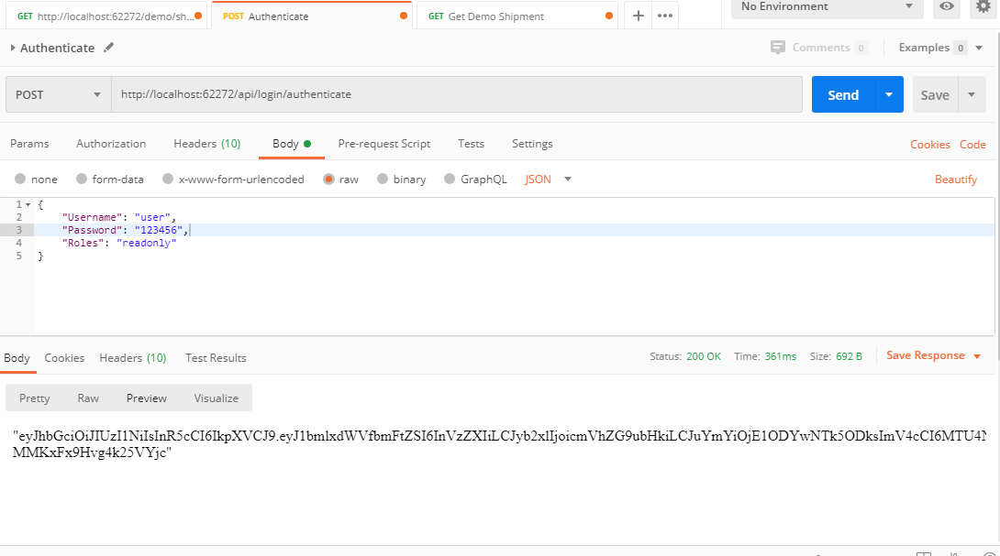
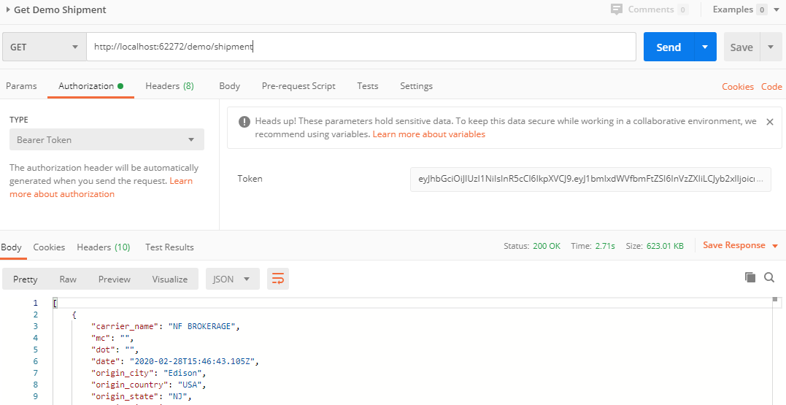
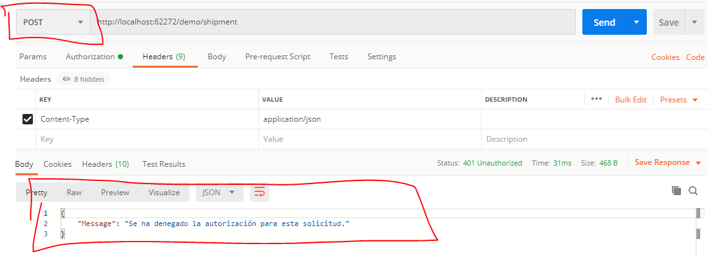

# lean_tech_backend_test

lean_tech_backend_test is a ASP.Net Web API REST Service.

## Installation

Donwloand the Project an execute.

## Usage

Test in postman, Add a http request with the url: http://localhost:62272/holamundo/txt to get text/plain "Hello world"

Test in postman, Add a http request with the url: http://localhost:62272/helloworld/json to get application/json { "message": "Hello world" }

## Usage Get current weekly price of Regular Conventional Retail gasoline.

Test in postman, Add a http request with the url: http://localhost:62272/api/eia to get information

## Usage Shipment Demo with search

Test in postman, Add a http request with the url: http://localhost:62272/demo/shipment to get information,
to search with text criteria add param route with the criteria to search 'http://localhost:62272/demo/shipment/Text here' to get information

## Usage Authentication with JWT

Test in postman, Add a http request with the url: http://localhost:62272/api/login/authenticate to get TOKEN

In the Headers set Content-type application/json

In the Body set with role "admin" or "readonly"

{
	"Username": "user",
	"Password": "123456",
	"Roles": "readonly"
}

and then set  type Authorization like Bearer Token and put the token

NO Authorization readonly Role for metheod POST

## Contributing
Pull requests are welcome. For major changes, please open an issue first to discuss what you would like to change.

Please make sure to update tests as appropriate.

## Versioning

For the versions available, see the [tags on this repository](https://github.com/jclavijoaleman/lean_tech_backend_test-/tags). 

## Authors

* **Jonathan Clavijo Aleman**

